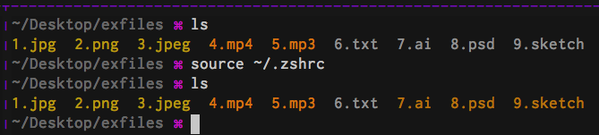

<h1>Modified Solarized Color Theme for GNU ls (as setup by GNU dircolors)</h1>

Colorizes the following additional files
- psd
- ai
- sketch

---

See [original repo](http://ethanschoonover.com/solarized)
for full list of features, installation, gotchas, etc.
